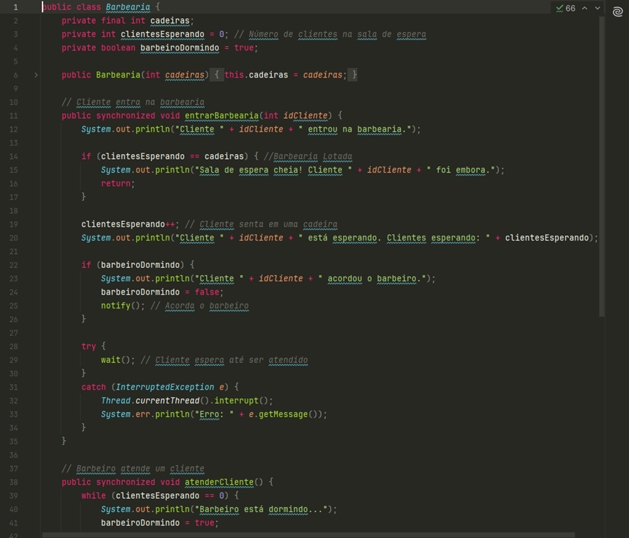
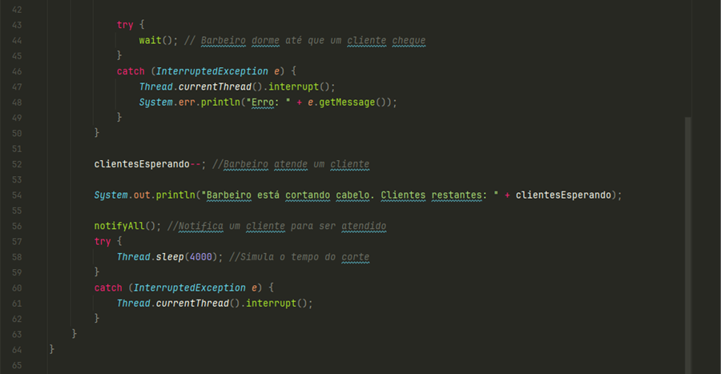
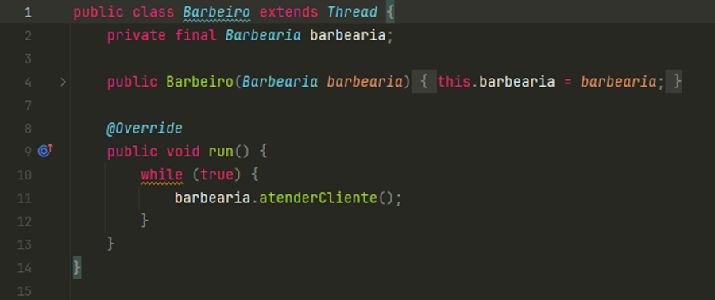
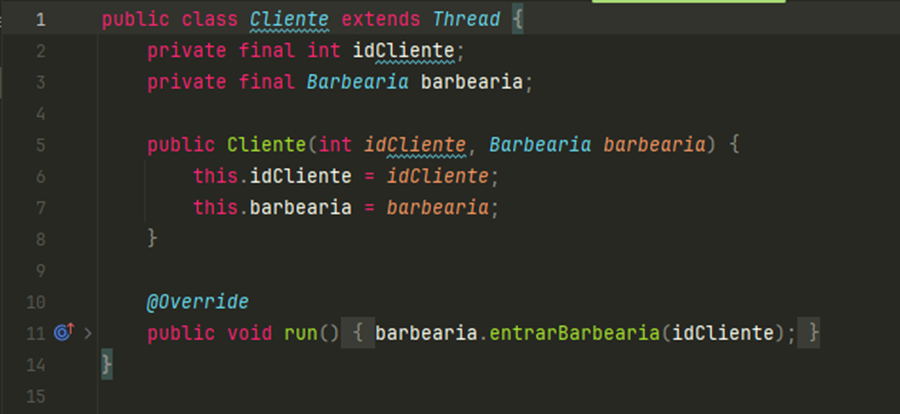
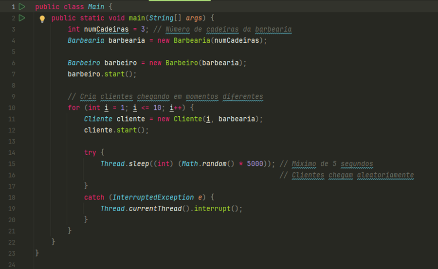
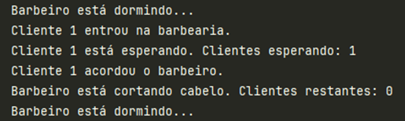
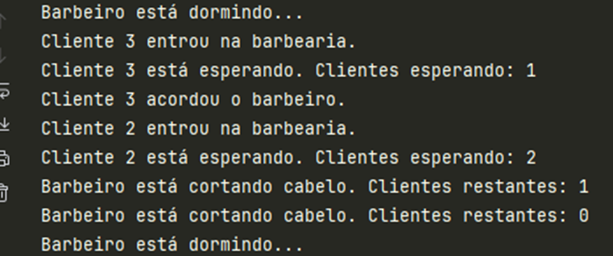
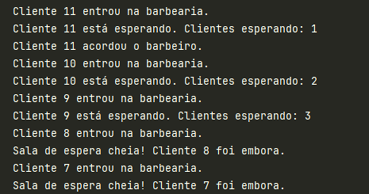
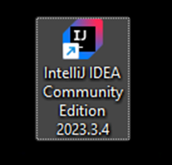
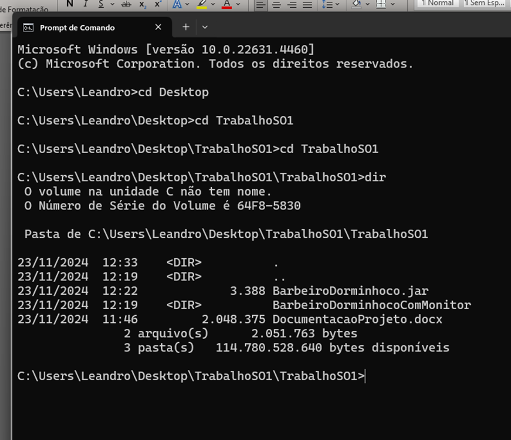

# 💈 Problema do Barbeiro Dorminhoco

Projeto desenvolvido para a disciplina de **Sistemas Operacionais I** da **UNOESTE – FIPP**, sob orientação do Prof. Robson Siscoutto.

---

## 👥 Integrantes

- Arcesti Giglio Ricci  
- João Vitor dos Santos  
- Leandro Marcos Cassemiro Rodrigues

---

## 🧠 Descrição do Problema

O **Problema do Barbeiro Dorminhoco** é um clássico da computação concorrente, utilizado para demonstrar o controle de acesso a recursos compartilhados (exclusão mútua).

Neste projeto, o problema foi resolvido utilizando **monitores em Java**, com os blocos `synchronized`, métodos `wait()` e `notify()`.

---

## 🛠️ Estrutura do Algoritmo

- **Classe `Barbearia`**  
  Gerencia a sala de espera, o estado do barbeiro e a sincronização entre as threads.

  
  

- **Classe `Barbeiro`**  
  Representa o barbeiro como uma thread que dorme quando não há clientes e atende quando há.

  

- **Classe `Cliente`**  
  Simula os clientes que chegam aleatoriamente, esperam se houver cadeiras disponíveis ou vão embora caso contrário.

  

- **Classe `Main`**  
  Responsável por iniciar a simulação, criando threads de clientes e do barbeiro.

  

---

## 🧪 Testes de Mesa

### Teste 1: Cliente chega e o barbeiro está dormindo
- Cliente 1 acorda o barbeiro.
- É atendido.
- Barbeiro volta a dormir após o atendimento.



### Teste 2: Cliente chega enquanto outro está sendo atendido
- Cliente 2 espera na sala.
- Barbeiro termina com Cliente 1 e atende Cliente 2.



### Teste 3: Sala de espera cheia
- Cliente 7 chega e vai embora por falta de espaço.




---

## ▶️ Como Executar

### Requisitos:
- Java Development Kit (JDK)
- IntelliJ IDEA (ou outro IDE Java)



### Passo a passo:

1. Extraia o conteúdo de `TrabalhoSO1.zip` ou clone o repositório do GitHub.
2. Abra o projeto `BarbeiroDorminhoComMonitor` no IntelliJ.
3. Navegue até `src/Main.java` e execute.
4. Observe os resultados no console.

### Alternativa via CMD:

1. Abra o terminal.
2. Acesse a pasta `do local do projeto`.
3. Execute com o comando:
   ```bash
   java -jar BarbeiroDorminhoco.jar


